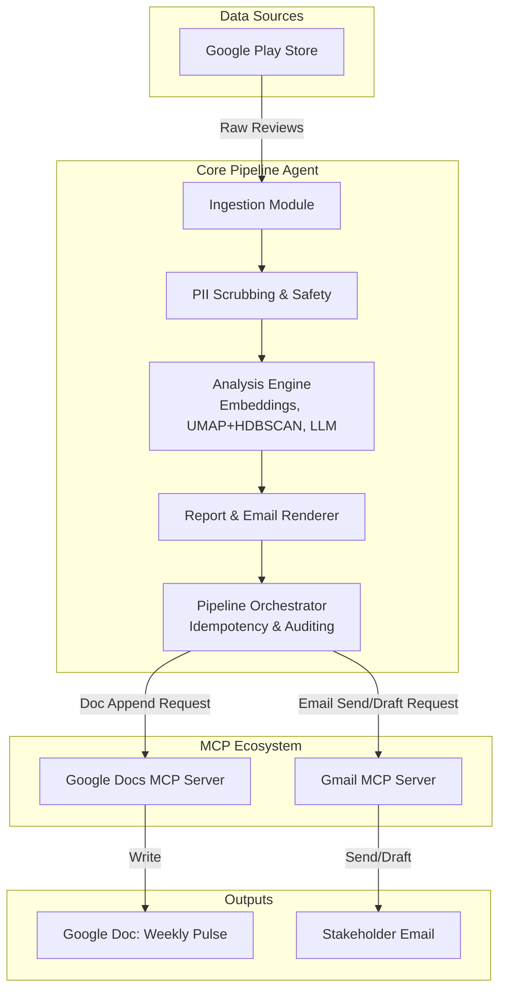

# Architecture Document: Weekly Product Review Pulse (Groww)

## 1. System Overview

The Weekly Product Review Pulse is an automated pipeline designed to ingest, analyze, and deliver insights from public Google Play Store reviews for the Groww application. The system operates on a weekly cadence, transforming unstructured user feedback into structured, actionable insights delivered directly to stakeholders via Google Workspace (Docs and Gmail) using Model Context Protocol (MCP) servers.

## 2. Component Architecture

The system is designed with a modular architecture, clearly separating data retrieval, analytical reasoning, output generation, and delivery.

### 2.1. Pipeline Orchestrator
The central controller of the pipeline. It is responsible for:
- Triggering the weekly run (e.g., via cron) or handling manual CLI invocations for backfilling specific ISO weeks.
- Managing **Idempotency**: Ensuring that re-running the pipeline for a specific ISO week does not result in duplicate document sections or emails. This is tracked via stable section anchors in the Google Doc and run-scoped IDs.
- **Auditing**: Recording metadata for each run, including Doc heading references, Gmail message IDs, token usage, and timestamps.

### 2.2. Ingestion Module
Responsible for retrieving data from external sources.
- **Source**: Google Play Store only.
- **Scope**: Retrieves reviews for the Groww app over a configurable rolling window (e.g., 8–12 weeks).
- **Output**: A standardized dataset of raw reviews ready for processing.

### 2.3. Processing & Analysis Engine
The reasoning core of the system, transforming raw text into clustered insights.
- **PII Scrubbing**: An initial pass to remove Personally Identifiable Information from review text before any external LLM processing.
- **Clustering**: Utilizes text embeddings coupled with density-based clustering algorithms (**UMAP + HDBSCAN**) to group similar reviews together based on semantic meaning.
- **LLM Summarization**: Processes the clustered groups to:
  - Extract and name recurring **Themes**.
  - Surface validated, real **User Quotes** (verbatim).
  - Propose actionable **Ideas** based on the feedback.

### 2.4. Output Rendering Module
Transforms the structured insights from the Analysis Engine into human-readable formats.
- **Doc Renderer**: Constructs a concise, one-page narrative for the Google Doc, including themes, quotes, action ideas, and target audience summaries.
- **Email Renderer**: Creates a short teaser email summarizing top themes as bullets and generating a deep link to the newly created section in the Google Doc.

### 2.5. Delivery via MCP Servers
The core pipeline **does not** handle Google OAuth credentials or directly call Google REST APIs. It acts as an MCP client communicating with dedicated MCP servers.
- **Google Docs MCP Server**: Receives formatted markdown/text and appends it as a new, dated section to the running "Weekly Review Pulse — Groww" document.
- **Gmail MCP Server**: Receives the teaser content and sends (or drafts) an email to the configured stakeholder list. In development/staging environments, this defaults to creating drafts only.

## 3. Data Flow Execution

1. **Trigger**: Orchestrator initiates a run for a target ISO week (scheduled or manual).
2. **Check Idempotency**: Orchestrator verifies if the week has already been processed. If so, it aborts or updates safely.
3. **Ingest**: Scrape Play Store reviews for the defined rolling window.
4. **Sanitize**: Scrub PII from the raw reviews.
5. **Cluster**: Generate embeddings and group reviews (UMAP + HDBSCAN).
6. **Analyze**: Pass clusters to the LLM to generate themes, verbatim quotes, and action items.
7. **Render**: Format the LLM output into the Doc layout and the Email teaser format.
8. **Deliver to Docs**: Orchestrator sends the Doc content to the Google Docs MCP server to append the new section. Retrieves the anchor link.
9. **Deliver to Gmail**: Orchestrator sends the Email content (including the Doc anchor link) to the Gmail MCP server to draft or send the notification.
10. **Audit**: Orchestrator logs the successful run, delivery IDs, and token usage constraints.

## 4. Key Constraints & Design Principles

* **Cost & Safety**: Strict enforcement of token limits per run. Reviews are treated strictly as data to prevent prompt injection, and PII is scrubbed pre-LLM.
* **Separation of Concerns**: Delivery mechanisms and secrets are entirely abstracted away into the MCP servers. The agent codebase focuses solely on ingestion, analysis, and orchestration.
* **System of Record**: The Google Doc acts as the immutable system of record, preserving the historical audit trail of weekly pulses. Emails are strictly notification vectors, not storage.
